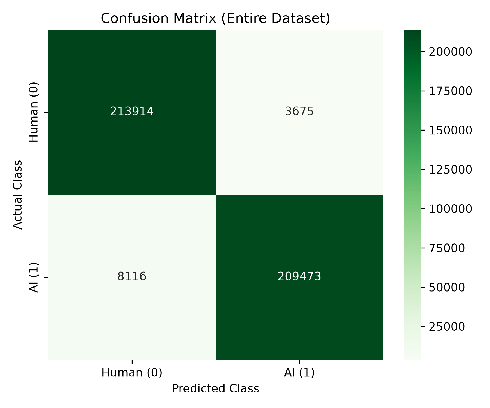
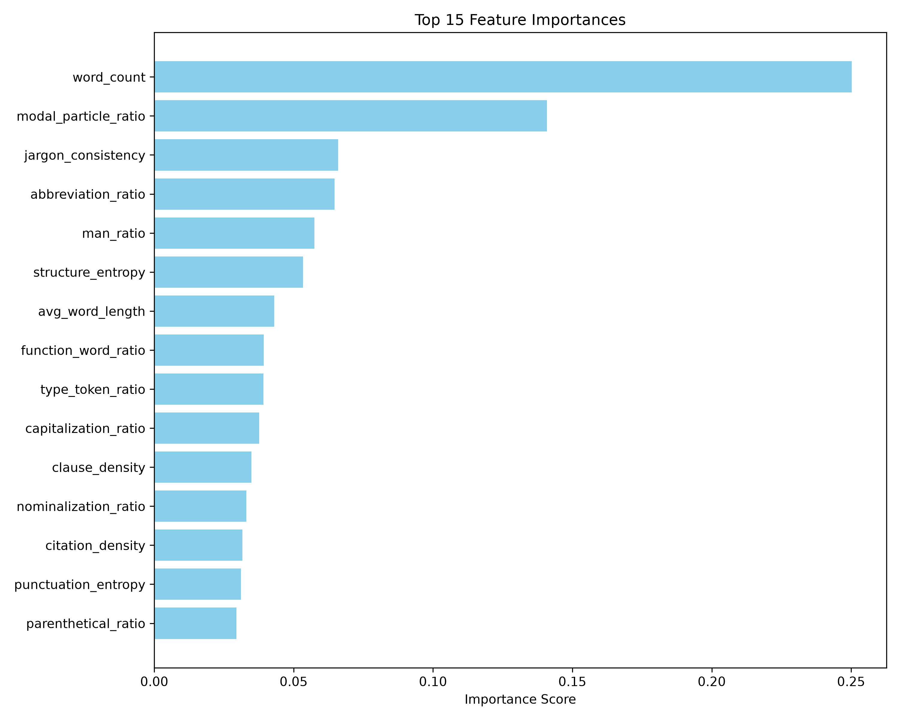

# 🇩🇪 German AI Detector (XGBoost)

An optimized machine learning pipeline and interactive web application designed to distinguish **Human-Written** German texts from **AI-Generated** German texts, specifically optimized for **administrative and legal contexts** (Verwaltungssprache). 

The detector leverages **18 handcrafted linguistic, lexical, and syntactic features** processed via spaCy and trained using an optimized **XGBoost Classifier**. It achieves a state-of-the-art **97.29% overall accuracy** while strictly controlling the **False Positive Rate (FPR) at 1.69%** (minimizing the risk of falsely accusing human authors).

---

## 📊 Performance & Results

To ensure the detector is reliable for real-world administrative use, our primary constraint was to keep the **False Positive Rate (FPR) below 2.0%**. Through hyperparameter tuning and decision threshold optimization, we achieved the following metrics:

### Partition Performance Summary

| Metric | Train Set (80%) | Validation Set (10%) | Test Set (10%) | Entire Dataset (100%) |
| :--- | :---: | :---: | :---: | :---: |
| **Total Samples** | 348,142 | 43,518 | 43,518 | **435,178** |
| **Accuracy** | 97.36% | 97.03% | 97.02% | **97.29%** |
| **Precision** | 98.33% | 97.99% | 98.14% | **98.28%** |
| **Recall (Sensitivity)** | 96.35% | 96.03% | 95.85% | **96.27%** |
| **F1-Score** | 97.33% | 97.00% | 96.98% | **97.26%** |
| **ROC-AUC** | 99.76% | 99.71% | 99.74% | **99.76%** |
| **False Positive Rate (FPR)** | 1.64% | 1.97% | 1.82% | **1.69%** |

### 📈 Visualizations

#### 1. Confusion Matrix (Entire Dataset)
The confusion matrix below illustrates predictions across all **435,178** samples. Out of 217,589 human-written sentences, only 3,675 were incorrectly classified as AI-generated, satisfying the <2% FPR constraint.



#### 2. Feature Importances (Top 15 Features)
The relative contribution of linguistic features to the model's decisions. Nominalization ratio (Nominalstil) and Type-Token Ratio (lexical diversity) carry the highest predictive power.



---

## 🗃️ Dataset Overview

The model was trained and evaluated on `data/training_pair_v5_clean.csv`, a balanced dataset comprising **435,178 sentences** (217,589 human-written and 217,589 AI-generated).

- **Human-Written Data**: Synthesized from official German administrative documents, notifications, and legal codices (e.g., Verwaltungsverfahrensgesetz - VwVfG).
- **AI-Generated Data**: Generated using advanced Large Language Models (LLMs) instructed to produce text mimicking German administrative and legal registers.
- **Data Splitting**: Split into **80% training** (348,142 sentences), **10% validation** (43,518 sentences), and **10% testing** (43,518 sentences) partitions to ensure robust evaluation.

---

## 🧪 Handcrafted Feature Engineering

Instead of using heavy, computationally expensive neural networks, this project utilizes **18 handcrafted syntactic and lexical features** extracted using the spaCy German NLP model (`de_core_news_sm`). This keeps inference near-instantaneous and highly explainable:

1. **`nominalization_ratio`**: Density of nouns ending in typical administrative suffixes (`-ung`, `-heit`, `-keit`, `-tion`, `-sion`).
2. **`type_token_ratio`**: Vocabulary richness (TTR). AI-generated texts tend to have lower lexical diversity.
3. **`punctuation_entropy`**: The complexity and diversity of punctuation usage.
4. **`function_word_ratio`**: Proportions of articles and conjunctions (e.g., *der, die, das, und, oder*).
5. **`avg_word_length`**: Average character length of words.
6. **`capitalization_ratio`**: Ratio of capitalized words (critical for detecting noun utilization in German).
7. **`passive_ratio`**: Frequency of passive voice auxiliary verbs (*wird, werden, wurde, worden*).
8. **`jargon_consistency`**: Density of standard legal words (*verwaltungsakt, behörde, ermessen*, etc.).
9. **`abbreviation_ratio`**: Frequency of abbreviations (e.g., *Abs., S., VwVfG*).
10. **`clause_density`**: Density of subjunctions introducing subordinate clauses (*dass, weil, wenn*, etc.).
11. **`citation_density`**: Presence of legal citation formats (e.g., *§ 35, Art. 12*).
12. **`authority_ratio`**: Mentions of administrative bodies (*Behörde, Amt, Gericht*).
13. **`parenthetical_ratio`**: Utilization of parentheses `(...)`.
14. **`modal_particle_ratio`**: Usage frequency of German modal particles (*ja, doch, halt, eben, mal*).
15. **`man_ratio`**: Ratio of the indefinite pronoun *man*.
16. **`structure_entropy`**: Paragraph/bullet point structural markers.
17. **`closing_ratio`**: Standardized formal closings (*mit freundlichen Grüßen*).
18. **`word_count`**: Total word count.

---

## 🛠️ Project Structure

```
german-ai-detector/
├── data/
│   ├── training_pair_v5_clean.csv      # Balanced dataset (435,178 sentences)
│   └── processed/                      # Extracted feature Parquet files
├── models/
│   ├── xgboost_model_optimized.pkl     # Final optimized XGBoost model
│   └── model_metadata_optimized.json   # Model performance metadata and configuration
├── reports/
│   ├── figures/                        # Generated evaluation charts
│   └── final_report.md                 # Detailed training & optimization report
├── src/
│   ├── 01_split_human_data.py          # Data ingestion and splitting
│   ├── 02_generate_ai.py               # AI data generation script
│   ├── 03_combine_dataset.py           # Dataset compilation script
│   ├── 04_feature_extraction.py        # SpaCy-based feature engineering
│   ├── 05_train_xgboost.py             # Basic model training
│   ├── optimize_xgboost.py             # Class weighting & threshold optimization
│   ├── app.py                          # Streamlit UI
│   └── train_clean_xgboost_pipeline.py # End-to-end pipeline execution
├── requirements.txt                    # Project dependencies
└── README.md                           # Project documentation
```

---

## 🚀 How to Run the Project

### 1. Installation
Clone the repository and install the dependencies:
```bash
pip install -r requirements.txt
python -m spacy download de_core_news_sm
```

### 2. Run Interactive Web UI
Launch the Streamlit web application to test arbitrary German texts:
```bash
python -m streamlit run src/app.py
```
Open [http://localhost:8501](http://localhost:8501) in your browser. The application loads the optimized XGBoost model and spaCy pipeline, enabling you to select preset example sentences or type custom administrative German texts for real-time classification.

### 3. Retrain and Optimize Model
To run the full feature extraction, train, and threshold optimization pipeline:
```bash
python src/train_clean_xgboost_pipeline.py
```
This script parallelizes spaCy feature extraction using Python multiprocessing, trains the XGBoost classifier, optimizes the decision threshold to target an FPR < 2%, and exports performance graphs to the `reports/figures/` directory.
