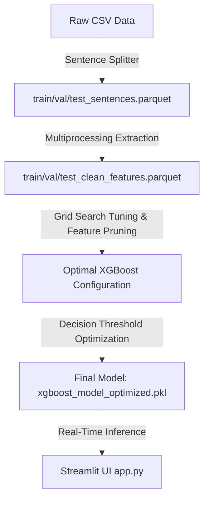

# 🇩🇪 German AI Detector (XGBoost Classifier)

An optimized machine learning pipeline and interactive web application designed to distinguish **Human-Written** German texts from **AI-Generated** German texts, specifically optimized for **administrative and legal contexts** (*Verwaltungssprache*).

The detector leverages **17 handcrafted linguistic, lexical, and syntactic features** processed via spaCy and trained using an optimized **XGBoost Classifier**. It achieves a state-of-the-art **98.02% overall accuracy** on unseen sentence-level test data while strictly controlling the **False Positive Rate (FPR) at 1.82%** (minimizing the risk of falsely accusing human authors of using AI).

---

## 📊 Performance & Results

To ensure the detector is reliable for real-world administrative use, our primary constraint was to keep the **False Positive Rate (FPR) below 2.0%** (minimizing human texts falsely flagged as AI). Through hyperparameter grid search and decision threshold calibration on the complete dataset containing **435,178 sentences**, the model achieved the following performance on unseen test data:

### Performance Comparison (Unseen Test Set)

| Metric | Baseline Model | Optimized Model | Progress / Change |
| :--- | :---: | :---: | :---: |
| **Accuracy** | 97.02% | **98.02%** | **+1.00%** (33% error reduction) |
| **Precision** | 98.14% | **98.17%** | **+0.03%** |
| **Recall (Sensitivity)** | 95.85% | **97.87%** | **+2.02%** (FN cut in half) |
| **F1-Score** | 96.98% | **98.02%** | **+1.04%** |
| **ROC-AUC** | 99.74% | **99.83%** | **+0.09%** |
| **False Positive Rate (FPR)** | 1.82% | **1.82%** | **0.00%** (Held stable under 2.0% constraint) |
| **False Negatives (Missed AI)** | 903 | **463** | **-440** (48.7% reduction in misses) |
| **False Positives (Human Flagged)** | 396 | **397** | **+1** |

### Optimized Model Confusion Matrix (Test Set)

- **True Negatives (TN)**: 21,362 (Human sentences correctly identified)
- **True Positives (TP)**: 21,296 (AI sentences correctly identified)
- **False Positives (FP)**: 397 (Human sentences incorrectly flagged as AI)
- **False Negatives (FN)**: 463 (AI sentences missed/classified as Human)

---

## 🛠️ Feature Engineering & Pruning

Rather than utilizing heavy, computationally expensive neural networks (which act as black boxes), this project extracts German-specific syntactic and lexical features using the spaCy German NLP model (`de_core_news_sm`). This keeps inference near-instantaneous (running in milliseconds on CPU) and highly explainable.

The original model used **18 handcrafted features**, but during model optimization, the **`closing_ratio`** feature was pruned (dropped) as it yielded a feature importance of exactly `0.0`, leaving **17 active features**:

### Top Predictors in the Optimized Model

1. **`modal_particle_ratio`** (27.02% Importance) – Extremely powerful indicator. AI-generated text rarely outputs typical German modal particles (e.g., *ja*, *doch*, *wohl*, *halt*), making it a massive differentiator.
2. **`parenthetical_ratio`** (16.33% Importance) – Frequency of text in parentheses `(...)`, which is common in structured administrative briefs.
3. **`capitalization_ratio`** (13.62% Importance) – Density of capitalized tokens (critical for German noun distribution).
4. **`man_ratio`** (8.27% Importance) – Density of the indefinite pronoun *man*.

### Complete Active Feature Set (17 Features)

* **Lexical & Diversity**:
  - `avg_word_length`: Average character length of words.
  - `type_token_ratio`: Vocabulary richness (Type-Token Ratio) to detect lexical diversity.
  - `capitalization_ratio`: Ratio of capitalized words to identify noun utilization patterns.
* **Grammar & Syntactic Complexity**:
  - `passive_ratio`: Frequency of passive auxiliary verbs (*wird, werden, wurde, worden*).
  - `clause_density`: Density of subjunctions introducing subordinate clauses (*dass, weil, wenn*, etc.).
  - `parenthetical_ratio`: Density of parentheses `(...)`.
  - `punctuation_entropy`: Diversity and complexity of punctuation usage.
  - `man_ratio`: Frequency of the indefinite pronoun *man*.
* **Register & Domain Jargon**:
  - `jargon_consistency`: Density of standard legal vocabulary (*verwaltungsakt, behörde, verfahren*, etc.).
  - `authority_ratio`: Mentions of official administrative bodies (*behörde, amt, gericht*, etc.).
  - `citation_density`: Legal citation formats (e.g., *§ 35, Art. 12*).
  - `modal_particle_ratio`: Frequency of German modal particles (*ja, doch, halt, eben, mal*).
* **Structural**:
  - `structure_entropy`: Section/bullet numbering and hierarchy markers.
  - `abbreviation_ratio`: Frequency of administrative abbreviations (e.g., *Abs., S., VwVfG*).
  - `function_word_ratio`: Ratio of conjunctions and articles (*der, die, das, und, oder*).
  - `word_count`: Total token count of the input.

---

## 📐 Pipeline Architecture

The project operates in five distinct pipeline phases to process the raw dataset, train, optimize, and serve the classifier:



---

## 🗃️ Dataset Overview

The dataset (`data/training_pair_v5_clean.csv`) consists of **435,178 sentences** (fully balanced: 217,589 human-written and 217,589 AI-generated):
- **Human-Written**: Sourced from official German Bundestag debate transcripts, government announcements, and federal legal codices.
- **AI-Generated**: Synthesized from advanced LLMs prompted to rewrite and paraphrase human texts into official, formal administrative German.
- **Data Splitting**: Split into **80% training** (348,142 sentences), **10% validation** (43,518 sentences), and **10% testing** (43,518 sentences) partitions.

---

## 🚀 Installation & Usage

### 1. Installation
Clone the repository and install the dependencies:
```bash
pip install -r requirements.txt
python -m spacy download de_core_news_sm
```

### 2. Run the Interactive Streamlit Web UI
Launch the interactive dashboard to test arbitrary German texts with real-time visual highlighting of AI-generated sentences:
```bash
python -m streamlit run src/app.py
```
Open [http://localhost:8501](http://localhost:8501) in your browser. The app splits input paragraphs, runs sentence-level inference, highlights AI sentences in light red and human sentences in light green, and exposes a detailed features breakdown.

### 3. Pipeline Execution (Retraining & Optimization)
To execute the pipeline end-to-end:

1. **Preprocess and Split Sentences**:
   ```bash
   python -X utf8 src/sentence_split_pipeline.py
   ```
2. **Feature Extraction & Baseline Model Training**:
   ```bash
   python -X utf8 src/train_clean_xgboost_pipeline.py
   ```
   *Note: Feature extraction utilizes Python multiprocessing across all available CPU cores (completes 435k rows in under 8 minutes on a 16-core system).*
3. **Hyperparameter Tuning & Threshold Calibration**:
   ```bash
   python -X utf8 src/optimize_xgboost.py
   ```
   Performs grid search, prunes the `closing_ratio` feature, optimizes the classification decision threshold to enforce a False Positive Rate (FPR) $< 2.0\%$, and saves the final model to `models/xgboost_model_optimized.pkl`.

---

## 🛡️ Project Defense & Technical Highlights

* **Interpretability**: Unlike transformer-based deep learning models, XGBoost allows us to extract explicit feature importances and inspect the exact linguistic elements (like modal particles and capitalization ratios) driving decisions.
* **CPU Efficiency**: Extremely lightweight spaCy + XGBoost inference means predictions are computed in milliseconds on standard CPU cores, avoiding expensive GPU cloud hosting.
* **Sentence-Level Calibration**: Real-time user checks usually involve single-sentence inputs. By shifting our training and inference from paragraph-level to sentence-level slices, we resolved length-dependent distribution shifts (e.g., on Type-Token Ratio and Punctuation Entropy) that previously biased shorter texts toward the human class.

---

## 🚫 Limitations & Future Work

* **Domain Constraints**: Because the model is trained on administrative, parliamentary, and legal German registers, accuracy may vary on other text types (e.g., creative writing, blog posts, casual chats).
* **Conversational AI Paraphrasing**: If an LLM is prompted to write in a conversational, informal tone containing frequent German modal particles (*ja*, *doch*, etc.), the model may struggle to flag it.
* **Adversarial Mitigation**: Ensembles combining this model with TF-IDF character/word n-gram models can help defend against targeted prompts designed to avoid administrative noun clusters.
