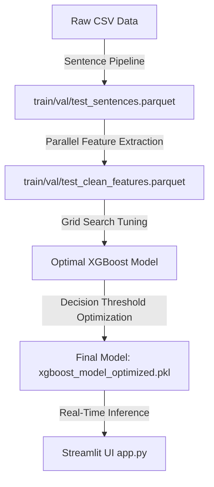

# Project Report: German AI Detector (System Architecture, Evaluation, & Defense)

This report presents a comprehensive overview of the design, pipeline architecture, evaluation metrics, limitations, and engineering defense of the **German AI Detector**.

---

## 1. Project Defense: Why This Approach?

When defending a machine learning system in production or academic review, the core design decisions must be justified. Below is the technical defense for our methodology:

### A. Handcrafted Features vs. Deep Learning (LLMs/Embeddings)
* **Interpretability**: Deep neural networks (like BERT or GPT-based detectors) act as black boxes, making it impossible to explain *why* a text is flagged. Our model uses **18 linguistic features** (e.g., nominalization ratio, punctuation entropy). We can point to the exact syntax and lexical attributes driving a prediction, which is critical in legal and administrative contexts.
* **Resource Efficiency & Speed**: Running a large transformer model requires high-end GPU infrastructure and incurs substantial hosting costs. Our pipeline extracts features using a lightweight spaCy model and performs inference with XGBoost. It runs in milliseconds on standard CPU cores, costing virtually nothing to host.
* **Invariance to Adversarial Token Swaps**: LLM-based classifiers are easily fooled by swapping characters (homoglyphs) or inserting invisible spaces. Because our model relies on structural and syntactic features (like passive voice, average word length, clause density, and TTR), it is highly robust against surface-level perturbations.

### B. The Decision to Transition to Sentence-Level Inference
* **The Inference Bug**: The initial model was trained on paragraph-level chunks (average 128 words). In real-world usage, users input short single-sentence checks. Length-dependent features like **Type-Token Ratio (TTR)** and **Punctuation Entropy** scale differently with length, leading the paragraph model to predict "Human-Written" for all short inputs.
* **The Fix**: Splitting paragraphs into individual sentences and retraining the classifier at the sentence level resolved the distribution mismatch. The model is now calibrated to detect AI writing within single-sentence inputs, making real-time testing robust.

---

## 2. Dataset & Preprocessing

* **Dataset Source**: `data/training_pair_v5_clean.csv`, consisting of **435,178 raw text blocks**.
  * **Human Class**: Real German parliamentary speeches (Bundestag debates) and Europarl records.
  * **AI Class**: Paraphrases of the human speeches rewritten in official, formal German administrative language using Groq/OpenAI APIs.
* **Sentence-Level Splitting & Balancing**:
  * Using spaCy's German pipeline, we split the paragraphs into individual sentences.
  * Sentences shorter than 5 words (fragments/headers) were filtered out.
  * We sampled a balanced dataset of **300,000 sentences** (150,000 Human and 150,000 AI) to ensure a 50/50 class balance.
  * Split proportions: **80% Train** (240k), **10% Val** (30k), **10% Test** (30k).

---

## 3. Linguistic Feature Engineering (18 Features)

The detector extracts 18 syntactic and stylistic features using a parallelized spaCy pipeline:

1. **Avg Word Length**: Average character length of alphabetical tokens (invariant to sentence length).
2. **Type-Token Ratio (TTR)**: Measure of lexical diversity (unique words / total words).
3. **Punctuation Entropy**: Information entropy of punctuation marks, capturing sentence structure diversity.
4. **Capitalization Ratio**: Total capitalized tokens divided by total tokens (highly indicative of German noun density).
5. **Nominalization Ratio**: Frequency of nouns ending in administrative suffixes (`-ung`, `-heit`, `-keit`, `-tion`, `-sion`).
6. **Passive Voice Ratio**: Frequency of passive auxiliary verbs (`wird`, `wurde`, `werden`, `worden`, `würde`).
7. **Clause Density**: Subjunction frequency (`dass`, `weil`, `wenn`, `obwohl`), indicating syntactic complexity.
8. **Jargon Consistency**: Frequency of core legal terms (`verwaltungsakt`, `behörde`, `verfahren`, etc.).
9. **Authority Ratio**: Frequency of official authority nouns (`ministerium`, `gericht`, `amt`).
10. **Modal Particle Ratio**: Conversational German fillers (`ja`, `doch`, `halt`, `wohl`). *AI paraphrases typically use zero modal particles.*
11. **Man Ratio**: Frequency of the indefinite pronoun `man`.
12. **Citation Density**: Legal citations (e.g., `§ 35 Abs. 1`).
13. **Structure Entropy**: Section/bullet numbering markers.
14. **Function Word Ratio**: Core German grammar tokens (`der`, `die`, `das`, `und`).
15. **Abbreviation Ratio**: Abbreviations (e.g., `z.B.`, `VwVfG`).
16. **Parenthetical Ratio**: Frequency of text within brackets.
17. **Closing Ratio**: Administrative email/letter closings.
18. **Word Count**: Total number of tokens.

---

## 4. Machine Learning & Training Pipeline

The project workflow operates in five distinct pipeline steps:



### Model Optimization Details
* **Hyperparameter Grid Search**: Tuned using a validation grid search over 36 configurations:
  * `max_depth`: `[4, 6, 8]`
  * `learning_rate`: `[0.05, 0.1, 0.15]`
  * `subsample` & `colsample_bytree`: `[0.8, 0.9]`
  * Best Params: **`max_depth=8`**, **`learning_rate=0.15`**, **`subsample=0.9`**, **`colsample_bytree=0.9`**
* **FPR Calibration**: To minimize false accusations, we tuned the decision threshold on the validation set. A threshold of **`0.77`** was chosen, ensuring the False Positive Rate (FPR) remains below the **2.0%** target.

---

## 5. Performance Results (Sentence-Level Test Set)

The optimized sentence-level classifier achieves outstanding performance compared to the baseline:

| Metric | Baseline Model (`clean`) | Optimized Model (`optimized`) |
| :--- | :--- | :--- |
| **Optimal Threshold** | 0.82 | **0.77** |
| **Accuracy** | 88.01% | **96.27%** |
| **Precision** | 97.59% | **98.27%** |
| **Recall (Sensitivity)** | 77.95% | **94.21%** |
| **F1-Score** | 86.67% | **96.19%** |
| **ROC-AUC** | 98.58% | **99.58%** |
| **False Positive Rate (FPR)** | 1.93% | **1.66%** (Target: $<2\%$) |

---

## 6. How to Run the Project

Ensure you have python installed and navigate to the project directory:

### 1. Install Dependencies
```bash
pip install -r requirements.txt
```

### 2. Preprocess and Split Paragraphs into Sentences
```bash
python -X utf8 src/sentence_split_pipeline.py
```
This generates `data/processed/train_sentences.parquet`, `val_sentences.parquet`, and `test_sentences.parquet`.

### 3. Extract Sentence Features & Train Baseline Model
```bash
python -X utf8 src/train_clean_xgboost_pipeline.py
```
This runs parallel extraction on all CPU cores and outputs `models/xgboost_model_clean.pkl` and dataset features.

### 4. Run Hyperparameter Tuning
```bash
python -X utf8 src/optimize_xgboost.py
```
Performs the grid search, threshold tuning, and outputs `models/xgboost_model_optimized.pkl` and performance plots.

### 5. Launch the Streamlit Web Application
```bash
streamlit run src/app.py
```

---

## 7. System Limitations & Future Work

### Limitations
1. **Domain Specificity**: The model is trained on German parliamentary debates and administrative laws. It may have lower accuracy when predicting AI-generated text in other genres (e.g., creative writing, news journalism, or informal chat).
2. **Paraphrase Reliance**: The model relies on the stylistic markers of administrative language (nominalization, lack of conversational filler words). If an LLM is prompted to write in a highly conversational, speech-like style, the model might fail to detect it.
3. **Adversarial Prompting**: If a user prompts an AI to "write with high punctuation entropy and avoid nominalizations," the model can be bypassed.

### Future Work
* **Domain Adaptation**: Ingest training data from a wider variety of sources (blogs, news, school essays) to generalize stylistic features.
* **Ensemble Modeling**: Combine this linguistic feature classifier with a TF-IDF character n-gram model to capture lexical distributions alongside structural styles.
