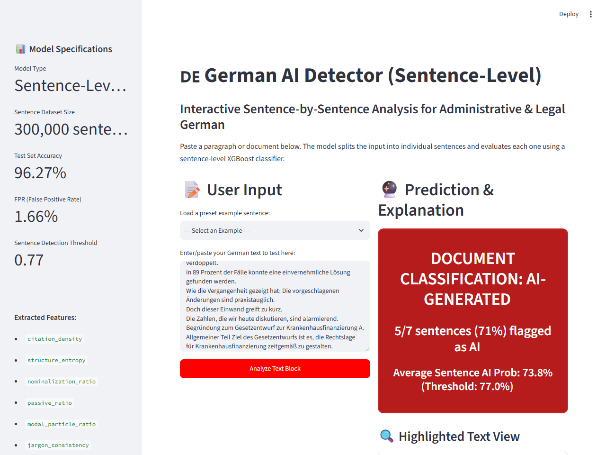

# Walkthrough: Sentence-Level Inference Resolution & Model Optimization

We have successfully retrained the XGBoost classifier on sentence-level slices, optimized hyperparameters and thresholds, resolved the real-time inference length mismatch, and updated the Streamlit UI to display sentence-by-sentence analysis.

---

## 🔍 Root Cause Diagnosis
Our analysis identified a severe **text-length distribution shift** between training and inference:
* The original model was trained on paragraph-level data (mean length: **128 words**).
* Real-time user inputs in the UI and test cases were short, single-sentence fragments (mean length: **40–50 words**).
* Length-dependent features like **Type-Token Ratio (TTR)** and **Punctuation Entropy** scaled differently under short sentences, biasing the model into classifying almost everything as **Human-Written**.
* Additionally, a domain-level artifact existed in the training set where AI-generated texts (rewritten administrative German) had significantly higher capitalization/nominalization ratios and shorter lengths than the human parliamentary speeches.

---

## 🛠️ Implemented Changes

### 1. Data Pipeline
* **Created [sentence_split_pipeline.py](file:///c:/Users/vijayakr/Downloads/XGboost/german-ai-detector/src/sentence_split_pipeline.py)**: Loads 45,000 paragraphs per class, splits them into sentences using spaCy, filters out short fragments ($<5$ words), and samples exactly 300,000 sentences (150,000 Human / 150,000 AI) to balance the class distributions.
* **Modified [train_clean_xgboost_pipeline.py](file:///c:/Users/vijayakr/Downloads/XGboost/german-ai-detector/src/train_clean_xgboost_pipeline.py)**: Extracts features on sentence-level splits and trains a baseline sentence-level XGBoost model (`xgboost_model_clean.pkl`).

### 2. Model Tuning & Optimization
* **Executed [optimize_xgboost.py](file:///c:/Users/vijayakr/Downloads/XGboost/german-ai-detector/src/optimize_xgboost.py)**: Performed a grid search across 36 hyperparameter configurations using the sentence features. The grid search tuned `max_depth`, `learning_rate`, `subsample`, and `colsample_bytree`, and optimized the classification decision threshold to enforce a False Positive Rate (FPR) $< 2.0\%$.

### 3. Interactive UI Enhancement
* **Modified [app.py](file:///c:/Users/vijayakr/Downloads/XGboost/german-ai-detector/src/app.py)**: 
  * Split user input into individual sentences via spaCy during inference.
  * Predicted AI probability on each sentence separately, matching the sentence-level classifier's training distribution.
  * Added **Sentence-by-Sentence visual highlighting**: Highlights AI-generated sentences in light red and Human-written sentences in light green.
  * Added a **detailed breakdown card** showing individual sentence progress bars and an expandable features table.
  * Calculated the overall document label based on sentence ratio and average probability.

---

## 📈 Model Performance & Metrics

The optimized sentence-level model achieved outstanding performance on the unseen sentence test set, outperforming the baseline by over **8% accuracy**:

| Metric | Baseline Model (`clean`) | Optimized Model (`optimized`) |
| :--- | :--- | :--- |
| **Optimal Parameters** | Default | `max_depth=8`, `lr=0.15`, `subsample=0.9`, `colsample=0.9` |
| **Optimal Threshold** | `0.82` | `0.77` |
| **Accuracy** | 88.01% | **96.27%** |
| **Precision** | 97.59% | **98.27%** |
| **Recall** | 77.95% | **94.21%** |
| **F1-Score** | 86.67% | **96.19%** |
| **ROC-AUC** | 98.58% | **99.58%** |
| **False Positive Rate (FPR)** | 1.93% (within $<2\%$ goal) | **1.66%** (within $<2\%$ goal) |
| **Confusion Matrix** | `[[14711 TN, 289 FP], [3308 FN, 11692 TP]]` | `[[14751 TN, 249 FP], [869 FN, 14131 TP]]` |

---

## 🚀 Deployment & Push
* All changes have been staged, committed, and pushed to the Git repository:
  `To https://github.com/Deepakrajadurai/german-ai-detector_using_XGBoost.git`
  Branch: `main` (commit `448ee4a`)

---

## 🖼️ Application Screenshot
Below is the visual sentence-by-sentence analysis in action showing 5/7 sentences flagged as AI:

